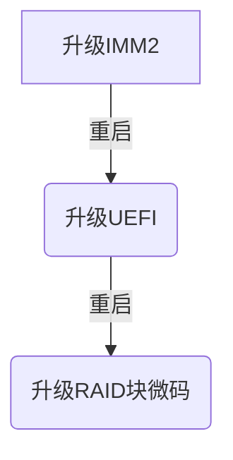
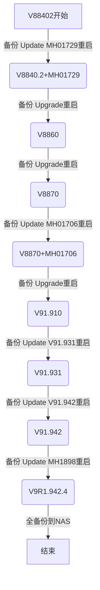

# HMC 7042-CR9 升级
目标：升级hmc V8R8.4.0.2 to V9 9.1-942

升级HMC微码


升级HMC系统


## 1 升级前备份
### 备份分区信息profile
``` 
for i in `lssysconn -r all -F type_model_serial_num `   
do   
   echo $i
   j=`echo $i|cut -d* -f2`
   echo $j
   bkprofdata -m $i -f $j2022
done
ls -la /var/hsc/profiles/* #检查
```
或者
``` 
lssyscfg -r sys -F type_model*serial_num | while read machine
do 
   bkprofdata -m "$machine" -f Beforeupgrade$(date +%Y%m%d) 
done
```
### 保存upgrade信息包含HMC配置及分区信息（前面备份的profile）

``` 
 monhmc -r disk -n 0     # df -h 需要安装IBM eezh脚本   ^^注1^^ 
 saveupgdata -r disk     #备份到本地LV
 saveupgdata -r diskusb  #备份到U盘FAT32分区
 tail -f /var/hsc/log/saveUpgradeFiles.log  #检查备份情况
```
###整体备份
``` 
bkconsdata -r sftp -h nim2 -u nimuser -d /tmp  #备份关键硬件管理控制台 (HMC) 数据-最大
```
## 2升级7042-CR9微码

[7042-CR7/8/9 BIOS 说明]( https://www14.software.ibm.com/webapp/set2/sas/f/hmcl/bios/home.html)
[7042-CR7/8/9 BIOS下载](https://public.dhe.ibm.com/software/server/hmc/bomc/) 
CR9版本
IMM:from 1.72 to  TCOE50B 5.40
UEFI: from 1.11 to TBEG44J 3.11
DSA: DSAOB6F 10.5
``` 
1) Boot the HMC from the CR9BoMC DVD
2) At the BOMC MENU, select option 3 (Advanced System Configuration)
3) At the Advanced System Configuration menu, select option 10 (Command Line for Advanced Users)
4) At the prompt, type the following command and hit enter:
./HMC_update_tool.sh
The "Hardware Management Console Flash Utility" will load.
5) To update the IMM, enter 1 and press Enter  升级IMM2
6) When finished, press Enter to reboot.
7) Repeat steps 1-4 and at the menu, enter 2 to update (ie. UEFI and DSA)升级UEFI.
8) When finished, press Enter to reboot.
9) Repeat steps 1-4 and at the menu, enter 3 to update the RAID controller and Ethernet adapter FW.升级RAID卡及网卡微码
10) When finished, press Enter to reboot.
```
## 3升级HMC系统
### 3.1升级v886
预升级小补丁MH01729.iso 400KB 接近高版本的gid统一问题，需要重启
[v886说明](https://www.ibm.com/support/pages/upgrading-hmc-version-884-or-later-version-886) 
[MH01729](https://delivery04.dhe.ibm.com/sar/CMA/HMA/07ax4/1/MH01729.readme.html) 
``` 
updhmc -t sftp -h nim2 -u nimuser --passwd ******  -f  /tmp/MH01729.iso
hmcshutdown -r -t now
```
升级v886使用网络image，需要20-30分钟
[v886需下载5个文件](https://public.dhe.ibm.com/software/server/hmc/network/v8860/) 

``` 
getupgfiles -r sftp -h nim2 -u nimuser --passwd ****** -d /tmp/hmcv8860x86
chhmc -c altdiskboot -s enable --mode upgrade
hmcshutdown -t now -r
```
### 3.2升级v887
升级v887使用网络image，需要20-30分钟
升级前需要执行bkprofdata和saveupgdata两部
[v8865个文件](https://public.dhe.ibm.com/software/server/hmc/network/v8870/) 

``` 
getupgfiles -r sftp -h nim2 -u nimuser --passwd ****** -d /tmp/hmcv8870x86
chhmc -c altdiskboot -s enable --mode upgrade
hmcshutdown -t now -r
```
备份
``` 
lssyscfg -r sys -F type_model*serial_num | while read machine
do 
   bkprofdata -m "$machine" -f After8870upgrade$(date +%Y%m%d) 
done
ls -la /var/hsc/profiles/*
```

``` 
 monhmc -r disk -n 0     # df -h 需要安装IBM eezh脚本   ^^注1^^ 
 saveupgdata -r disk     #备份到本地LV
 saveupgdata -r diskusb  #备份到U盘FAT32分区
 tail -f /var/hsc/log/saveUpgradeFiles.log  #检查备份情况
```
### 3.3升级V9 R1 M910
[V9R1说明](https://www.ibm.com/support/pages/model-7042x86-upgrading-hmc-version-886-or-later-version-9) 
预升级小补丁iFIX MH01706
``` 
#sha1sum MH01706_x86.iso
188d720711943fa2019fbddb4f8d02e527afc59a  MH01706_x86.iso
updhmc -t sftp -h nim2 -u nimuser --passwd ******  -f  /tmp/hmcv8870x86/MH01706_x86.iso
hmcshutdown -r -t now
```
执行备份3步（参考前面）

``` 
lssyscfg -r sys -F type_model*serial_num | while read machine
do 
   bkprofdata -m "$machine" -f Before910upgrade$(date +%Y%m%d) 
done
saveupgdata -r disksftp -h nim2 -u nimuser --passwd ****** -d /tmp/$(lshmc -v |grep SE|cut -c5-12)
bkconsdata -r sftp -h nim2 -u nimuser --passwd ****** -d /tmp/$(lshmc -v |grep SE|cut -c5-12)
```
升级V9 R1 M910 Upgrade

``` 
# sha1sum HMC_Recovery_V9R1M910_1_x86.iso
8e616061bc6c2228cb504a755ea64c3a22b49374  HMC_Recovery_V9R1M910_1_x86.iso
解压缩ISO文件提取Recovery网络启动的5个文件
base.img 
disk1.img
hmcnetworkfiles.sum
img2a 
img3a 
getupgfiles -r sftp -h nim2 -u nimuser --passwd ****** -d /export/spot/hmc-iso
chhmc -c altdiskboot -s enable --mode upgrade
hmcshutdown -t now -r
```
升级v931
执行备份2步（简化-参考前面）

``` 
lssyscfg -r sys -F type_model*serial_num | while read machine
do 
   bkprofdata -m "$machine" -f Before931upgrade$(date +%Y%m%d) 
done
#不是upgrade操作不需要
#saveupgdata -r disksftp -h nim2 -u nimuser --passwd ****** -d /tmp/$(lshmc -v |grep SE|cut -c5-12)
bkconsdata -r sftp -h nim2 -u nimuser --passwd ****** -d /tmp/$(lshmc -v |grep SE|cut -c5-12)
```
执行升级updhmc V9R1M931
``` 
# sha1sum HMC_Update_V9R1M931_x86.iso
22308032ac6668e0d992725edfc410d412f2389e  HMC_Update_V9R1M931_x86.iso
updhmc -t sftp -h nim2 -u nimuser --passwd ******  -f  /export/spot/hmc-iso/HMC_Update_V9R1M931_x86.iso
hmcshutdown -r -t now
```
执行升级updhmc MH01853 400KB
``` 
updhmc -t sftp -h nim2 -u nimuser --passwd ******  -f  /export/spot/hmc-iso/MH01853_x86.iso
hmcshutdown -r -t now
```
执行升级updhmc V9R1M942 
``` 
updhmc -t sftp -h nim2 -u nimuser --passwd ******  -f  /export/spot/hmc-iso/HMC_Update_V9R1M942_x86.iso
hmcshutdown -r -t now
|HMC_Update_V9R1M942_x86.iso |4186636288 |394ba360602dd14831737a920d8a50906e70f234 |
```
执行升级updhmc MH01898
``` 
updhmc -t sftp -h nim2 -u nimuser --passwd ******  -f  /export/spot/hmc-iso/MH01898_x86.iso
hmcshutdown -r -t now
|MH01898_x86.iso |4186636288 |a35cb62797ee9a21545391c6e4d8d1655602e4ea |
```
成功后完全备份
``` 
lssyscfg -r sys -F type_model*serial_num | while read machine
do 
   bkprofdata -m "$machine" -f V942$(date +%Y%m%d) 
done
ls -la /var/hsc/profiles/*
ssh nimuser@nim2 "mkdir /tmp/$(lshmc -v |grep SE|cut -c5-12)"
saveupgdata -r disksftp -h nim2 -u nimuser --passwd ****** -d /tmp/$(lshmc -v |grep SE|cut -c5-12)
bkconsdata -r sftp -h nim2 -u nimuser --passwd ****** -d /tmp/$(lshmc -v |grep SE|cut -c5-12)
```

注意事项：
bkconsdata命令特别慢，有时超过1小时


